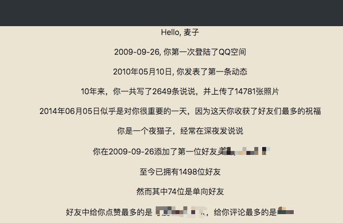
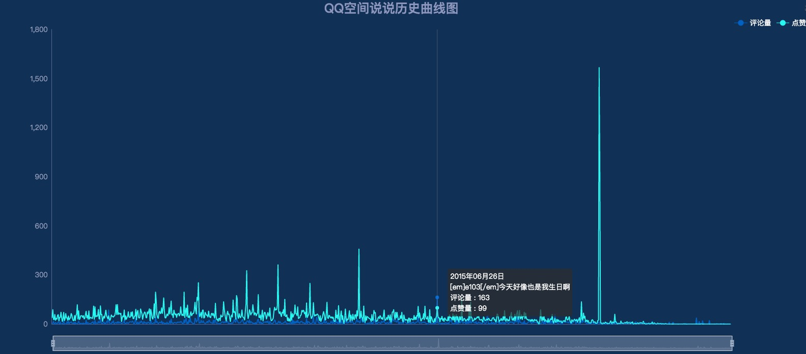
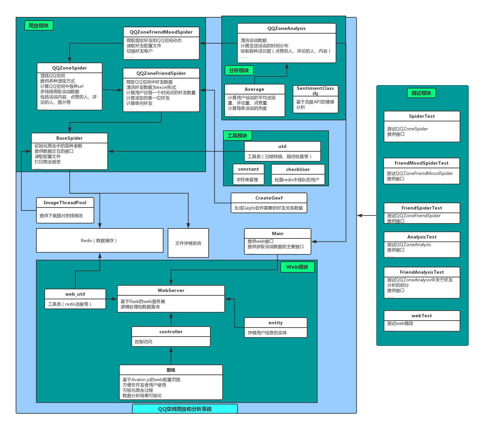
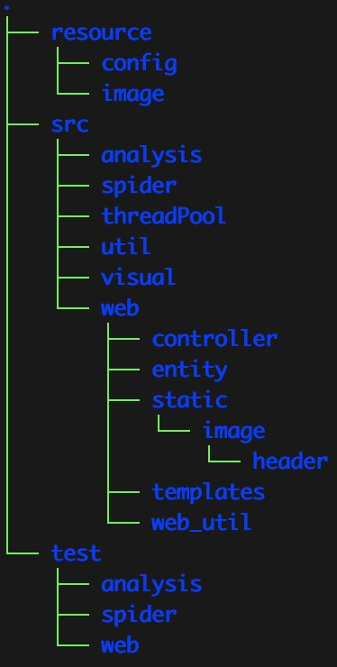
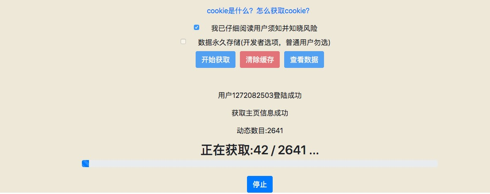
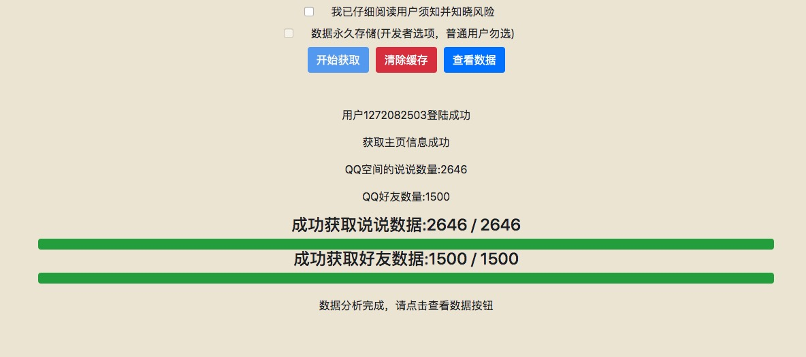
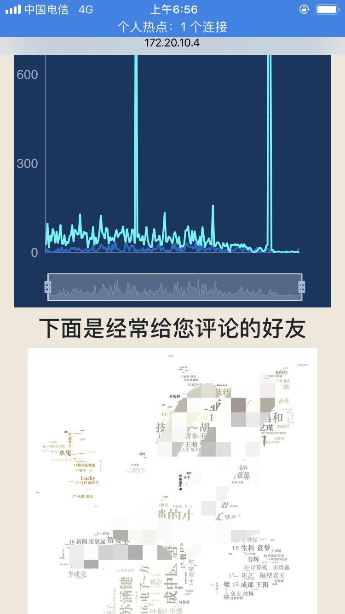

# QQZoneMood

-  多线程抓取QQ空间说说内容并进行分析，提供基于Flask和avalon.js的web配置界面，以及配套的测试用例

- 在线系统（支持移动端）:[QQ空间数据分析-小麦冬](http://app.xiaomaidong.com)

### 系统架构图

### docker版运行方式

- 本项目将网页配置版本打包为docker（以下简称docker版），本版本计划部署到线上

- 此外，还有大量已完成的功能（爬取好友的动态、爬取图片等）未进行整合

- docker版主要包括以下功能：

	> 1.配置用户名、QQ号、爬取动态的数量、停止日期、识别码、cookie等参数

	> 2.根据1中配置获取QQ空间的动态数量和好友基本信息

	> 3.清除缓存

	> 4.数据可视化和下载（excel表）

- 运行方式(请确保已经安装了docker和docker-compose)：

	> git clone https://github.com/Maicius/QQZoneMood.git

	> cd QQZoneMood

	> docker-compose up
	
	> 浏览器里输入地址: [http://localhost:80](http://localhost:80)

### TO DO...

- 将更多的功能整合到docker版中
- Web排队机制（为上线做准备）
- Web展示界面优化（想做成网易云年度歌单的风格）
- 计算更多指标

### 已实现功能

##### 1.基本功能

> 这部分主要是获取数据和进行基本的统计分析

- QQ空间动态爬取，包括：

	> 1. 所有说说信息
	> 2. 每条说说的详细信息（比1中的信息更全面，1中数据只显示每条说说的前10个评论）  
	> 3. 每条说说的点赞人列表
	> 4. 更加详细的点赞人列表（3中获取的数据有很多被清空了，这里能稳定获取到点赞的人数量、浏览量和评论量）
	> 5. 所有说说的图片（可选择是下载大图、缩略图还是都下载）
	
- QQ空间好友基本信息爬取
	
	> 1. 好友基本信息
	> 2. 共同好友数量
	> 2. 共同群组
	> 3. 添加好友时间(可计算出用户在每个时间点的好友数量)
	
- 数据分析
	
	> 1. 数据清洗，将所有抓取的信息清洗为excel或csv
	> 2. 包括各种点赞排行、评论排行、发送时间统计等
	> 3. 历史说说一览表

- 数据可视化

	> 包括各种词云图、关系图

- Web配置界面

	> 使用Flask + avalon.js + echarts.js 搭建的简易web界面，为普通用户提供一个快速获取数据的方法
	
	> 可视化爬虫过程
	
	> 可视化用户数据、历史说说记录
	
##### 2.衍生功能（这部分功能的代码没有完全添加到项目里）

- QQ空间动态情感检测

	> 基于[百度自然语言处理API](http://ai.baidu.com/tech/nlp/sentiment_classify),可免费使用

- QQ空间照片评分
	
	> 基于[Google NIMA模型](https://modelzoo.co/model/nima)

- QQ空间好友关系演变图
	
	> [戳这里查看视频演示](https://v.youku.com/v_show/id_XMzkxMDQ0NTcyMA==.html?spm=a2hzp.8253869.0.0)

### 项目结构

说明如下：

#### resource:存放数据文件（不包括web中的静态资源）
#### src-spider:包括四个爬虫类和一个入口

- BaseSpider(object): 爬虫基类，初始化各种变量和提供基础接口，统一管理爬虫的headers、数据的加载和存储
- QQZoneSpider(BaseSpider):爬取QQ空间动态的主要逻辑，包括各种url的构建
- QQZoneFriendSpider(QQZoneSpider): 爬取用户的好友基本信息和共同群组，计算用户在各个时间段的好友数量
- QQZoneFriendMoodSpider(QQZoneSpider):爬取用户指定好友的动态
- main: 程序入口，为web程序提供爬虫API

#### src-analysis:

- QQZoneAnalysis: 数据清洗，将爬虫得到的原始数据清洗为excel形式，并做简单的数据统计和分析
- Average: 计算平均评论量、点赞量、浏览量等数据
- SentimentClassify: 调用百度人工智能API进行情感分类
- TrainMood：已废弃，以前计划用来对文本内容分类等等

#### src-visual:

- CreateGexf: 将用户好友数据生成Gephi软件可以接受的数据格式以进行聚类

#### src-web：网站模块

- src-web-entity: 实体类
- static: 静态资源，外部引用的包主要使用cdn
- templates：网页

### 系统说明

- python版本：3.6
- 模拟登陆时若出现图形验证码，可以在点击登陆后设置5秒暂停，以手动完成验证
- 数据存储方式：

	> 目前提供了两种存储方式的接口（通过Spider中use_redis参数进行配置）:  
	> 1. 存储到json文件中   
	> 2. 存储到redis数据库中  
	> 如果安装了redis，建议存储到redis中  
	> 关于redis的安装和配置，请自行搜索  
	> Redis使用中常见问题可以参考这篇博客:[Redis 踩坑笔记](http://www.xiaomaidong.com/?p=308)

- *注意*：
 
 	> 本爬虫登录部分是使用的selenium模拟登陆，需要手动下载chrome driver和chrome浏览器  
	> 请注意版本匹配，可以查看这篇博客：  
	> [selenium之 chromedriver与chrome版本映射表（更新至v2.32）](http://blog.csdn.net/huilan_same/article/details/51896672)

#### 开发者运行方式 

- 1.安装依赖

	> pip3 install -r requirements.txt 

- 2.修改配置文件

	> 修改userinfo.json.example为文件userinfo.json，并填好QQ号、QQ密码、保存数据用的文件名前缀；
	
	> [可选]修改需要爬取的好友的QQ号和保存数据用的文件名前缀
	
- 3.\_\_init\_\_函数参数说明，请根据需要修改（所有参数都有默认值，即使不修改任何参与也能运行）	

		def __init__(self, use_redis=False, debug=False, mood_begin=0, mood_num=-1, stop_time='-1',
                 download_small_image=False, download_big_image=False,
                 download_mood_detail=True, download_like_detail=True, download_like_names=True, recover=False,
                 cookie_text=None, from_web=False, username='', nickname='', no_delete=True, pool_flag='127.0.0.1'):

        :param use_redis: If true, use redis and json file to save data, if false, use json file only.
        :param debug: If true, print info in console
        :param mood_begin: 开始下载的动态序号，0表示从第0条动态开始下载
        :param mood_num: 下载的动态数量，最好设置为20的倍数
        :param stop_time: 停止下载的时间，-1表示全部数据；注意，这里是倒序，比如，stop_time="2016-01-01",表示爬取当前时间到2016年1月1日前的数据
        :param recover: 是否从redis或文件中恢复数据（主要用于爬虫意外中断之后的数据恢复），注意，此功能在多线程中不可用
        :param download_small_image: 是否下载缩略图，仅供预览用的小图，该步骤比较耗时，QQ空间提供了3中不同尺寸的图片，这里下载的是最小尺寸的图片
        :param download_big_image: 是否下载大图，QQ空间中保存的最大的图片，该步骤比较耗时
        :param download_mood_detail:是否下载动态详情
        :param download_like_detail:是否下载点赞的详情，包括点赞数量、评论数量、浏览量，该数据未被清除
        :param download_like_names:是否下载点赞的详情，主要包含点赞的人员列表，该数据有很多都被清空了
        :param from_web: 表示是否来自web接口，如果为True，将该请求来自web接口，则不会读取配置文件
        :param username: 在web模式中，传递过来的用户QQ号
        :param nickname: 在web模式中，传递过来的用户昵称
        :param no_delete: 是否在redis中缓存数据，如果为True,则不会删除，如果为False，则设置24小时的缓存时间
        :param pool_flag: redis的连接池host，因为docker中host与外部不同，所以在启动程序时会自动判断是不是处于docker中
        
- 4.运行flask服务器

	> python3 src/web/server.py

- 5.其它程序入口可以参考test中测试用例

- 运行结果例图：

> QQ动态关键字词云

  
> QQ空间说说按点赞和评论数分类图

> 手机端运行截图

> 使用Gephi软件生成的好友关系图