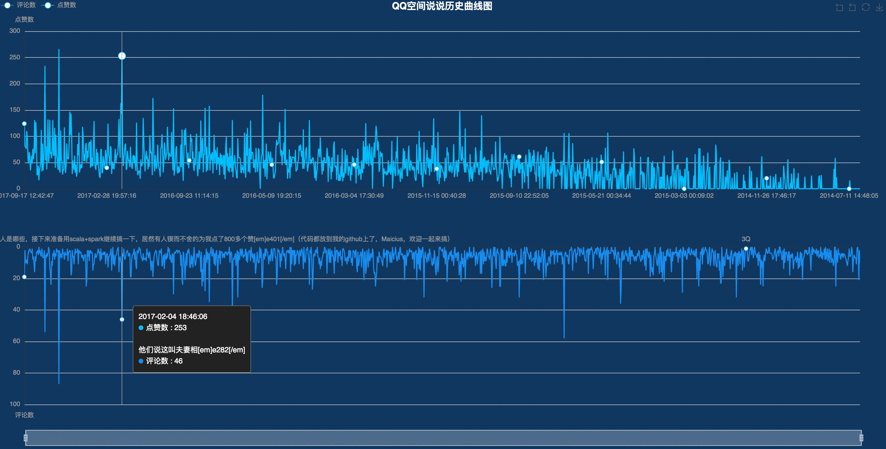
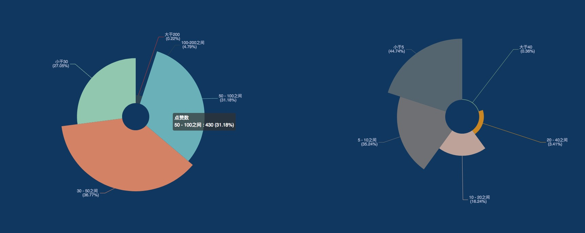

# QQZoneMood

-  抓取QQ空间说说内容并进行分析

## 代码重构中...

### 已实现功能

##### 1.基本功能

> 这部分主要是获取数据和进行基本的统计分析

- QQ空间动态爬取
	
	> 包括用户和好友，但是为了保护隐私，没有提供一键爬取所有好友动态的功能
	
- QQ空间好友基本信息爬取

	> 包括共同好友数量、共同群组、添加好友时间

- QQ空间中各种基本信息统计

	> 包括各种点赞排行、评论排行、发送时间统计等

- 数据可视化

	> 包括各种词云图、关系图

##### 2.衍生功能

> 这部分的目标是推算什么样的动态内容更受好友欢迎以及构建用户画像，但是很遗憾，目前获得的数据价值有限

- QQ空间动态内容分类

	> 分为7大类，自己标注的数据集(7231条数据,未公开，如有需要请邮件联系并说明原因)，使用RNN进行分类

- QQ空间动态情感检测

	> 基于[百度自然语言处理API](http://ai.baidu.com/tech/nlp/sentiment_classify),可免费使用

- QQ空间照片评分
	
	> 基于[Google NIMA模型](https://modelzoo.co/model/nima)
	
- QQ空间照片内容检测
	
	> 基于Fast R-CNN

- QQ空间中动态受好友的欢迎程度与动态内容的关系模型拟合

	> 将从动态中抽取的文字内容、图片内容转化为离散型或连续型变量，并将动态的点赞量、评论量、浏览量转化为热度作为标签，使用xgboost对以上数据进行拟合

- QQ空间好友关系演变图
	
	> [戳这里查看视频演示](https://v.youku.com/v_show/id_XMzkxMDQ0NTcyMA==.html?spm=a2hzp.8253869.0.0)

### 爬虫文件

### QQZone.py

- python版本：3.6（推荐使用python3，因为本爬虫涉及大量文件交互，python3的编码管理比2中好很多）
- 登陆使用的是Selenium， 无法识别验证码，抓取使用requests
- 若出现图形验证码，程序在点击登陆后设置了5秒暂停，可以手动完成验证
- 已经抓取到的信息有：

	> 1. 所有说说信息
	> 2. 每条说说的详细信息（比1中的信息更全面，1中数据只显示每条说说的前10个评论）  
	> 3. 每条说说的点赞人列表
	> 4. 更加详细的点赞人列表（3中获取的数据有很多被清空了，这里能稳定获取到点赞的人数量、浏览量和评论量）
	> 5. 所有说说的图片（可选择是下载大图、缩略图还是都下载）
	> 6. 用户好友数据(可计算出用户在每个时间的好友数量)

- 存储方式：

	> 目前提供了两种存储方式的接口（通过Spider中use_redis参数进行配置）:  
	> 1. 存储到json文件中   
	> 2. 存储到redis数据库中  
	> 如果安装了redis，建议存储到redis中  
	> 关于redis的安装和配置，请自行搜索  
	> Redis使用中常见问题可以参考这篇博客:[Redis 踩坑笔记](http://www.xiaomaidong.com/?p=308)

- *注意*：
 
 	> 本爬虫登录部分是使用的selenium模拟登陆，需要手动下载chrome driver和chrome浏览器  
	> 请注意版本匹配，可以查看这篇博客：  
	> [selenium之 chromedriver与chrome版本映射表（更新至v2.32）](http://blog.csdn.net/huilan_same/article/details/51896672)

#### QQZone运行方式 

- 1.安装依赖

	> pip3 install -r requirements.txt 

- 2.修改配置文件

	> 修改userinfo.json.example为文件userinfo.json，并填好QQ号、QQ密码、保存数据用的文件名前缀；
	
	> [可选]修改需要爬取的好友的QQ号和保存数据用的文件名前缀
	
- 3.\_\_init\_\_函数参数说明，请根据需要修改	

		 def __init__(self, use_redis=False, debug=False, mood_begin=0, mood_num=-1,
                 download_small_image=False, download_big_image=False,
                 download_mood_detail=True, download_like_detail=True, download_like_names=True, recover=False):

                :param use_redis: If true, use redis and json file to save data, if false, use json file only.
        :param debug: If true, print info in console
        :param file_name_head: 文件名的前缀
        :param mood_begin: 开始下载的动态序号，0表示从第0条动态开始下载
        :param mood_num: 下载的动态数量，最好设置为20的倍数
        :param stop_time: 停止下载的时间，-1表示全部数据；注意，这里是倒序，比如，stop_time="2016-01-01",表示爬取当前时间到2016年1月1日前的数据
        :param recover: 是否从redis或文件中恢复数据（主要用于爬虫意外中断之后的数据恢复）
        :param download_small_image: 是否下载缩略图，仅供预览用的小图，该步骤比较耗时，QQ空间提供了3中不同尺寸的图片，这里下载的是最小尺寸的图片
        :param download_big_image: 是否下载大图，QQ空间中保存的最大的图片，该步骤比较耗时
        :param download_mood_detail:是否下载动态详情
        :param download_like_detail:是否下载点赞的详情，包括点赞数量、评论数量、浏览量，该数据未被清除
        :param download_like_names:是否下载点赞的详情，主要包含点赞的人员列表，该数据有很多都被清空了
        
- 5.获取自己空间的动态数据

	> python3 QQZoneSpider.py
	
- 6.获取好友列表并计算每个时间点的好友数量

	> python3 QQZoneFriendSpider.py

- 7.获取指定好友的动态详情

	> python3	QQZoneFriendMoodSpider.py

- 8.数据清理，导出csv结构数据

	> python3 QQZoneAnalysis.py

### 数据分析

- python版本：3.6  
- 已经实现的分析有：

	> 1. 平均每条说说的点赞人数  
	> 2. 说说点赞的总人数
	> 3. 点赞最多的人物排名和点赞数
	> 4. 评论最多的人物排名和评论数
	> 5. 所有说说的内容分析（分词使用的是jieba）
	> 6. 所有评论的内容分析

- 待实现的目标有：

	> 发什么样的内容容易获得点赞和评论(自然语言处理)

	> 发什么样的图片容易获得点赞和评论(图像识别)

	> [可选]人物画像：分析出人物的性格特点、爱好(知识图谱)

	> [可选]历史事件抽取（自然语言处理、事件抽取）

- 运行结果例图：

  
  

> QQ动态关键字词云

> 好友关系图